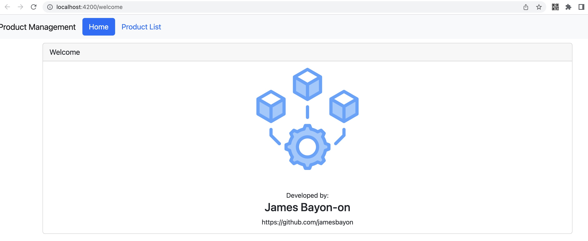
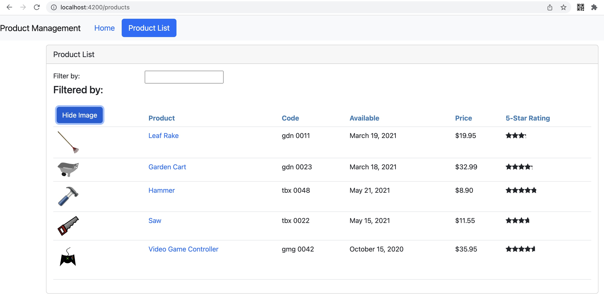
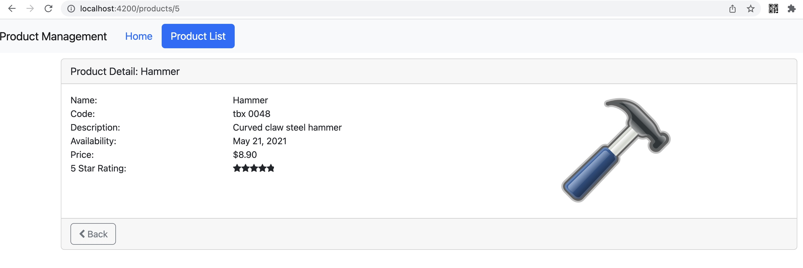

# Angular Product Management Demo App

Created a Product Management Single Page Application (SPA) product using Angular.

Here you have a navigation to the index/welcome page and the product list page. You can also view the product details of each product.

The products are from a json file and loaded to the application via a product service using http.

Separated into 3 modules: AppModule, ProductModule, SharedModule.

Here are the sample screenshots:

guide source:

https://www.pluralsight.com/courses/angular-2-getting-started-update

### Part 1

Create a component

Define a linked template in a component product-list

added bootstrap and font-awesome in dependencies

`npm install bootstrap font-awesome`

created product-list.component html and ts

added ProductListComponent in app.module.ts declarations

updated product-list.component.html to display products from ProductListComponent.products

### Part 2

Property binding for images in the product list

Handling events with Event binding for show and hide image button

Handling Input with 2-way binding with the filter by box via ngModel binding

Transforming data with pipes - display price with USD 

### Part 3

defined product interface 

encapsulate product-list.component.css

implement lifecycle hook OnInit

created custom pipe to covert - to spaces

getter-setter for _listFilter

defined performFilter() called onInit and filters product list depending on the input in listFilter

### Part 4

created Star component for rating

used nested star component with @Input() and @Output() decorator

used property binding and event binding for product rating

### Part 5

create a product data service

moved the product data to the service

inject product data service in the product list constructor

### Part 6

modify product data service to return an Observable

add exception handling to product data service

add subscribe for the Observable on OnInit

call unsubscribe for the Observable on OnDestroy

### Part 7

added navigation with routerLink to page

added welcome component and product detail component

added routes for welcome and product detail

### Part 8

added product detail guard in routes for incorrect index and NaN in urls

created temporary product detail html 

temporarily used single hard coded product for product view

### Part 9

separated modules from app module to minimize code/modularity - added product module and shared module

moved declaration, imports, and added exports

### Part 10

updated product detail html to display the product selected instead of hard coded product

